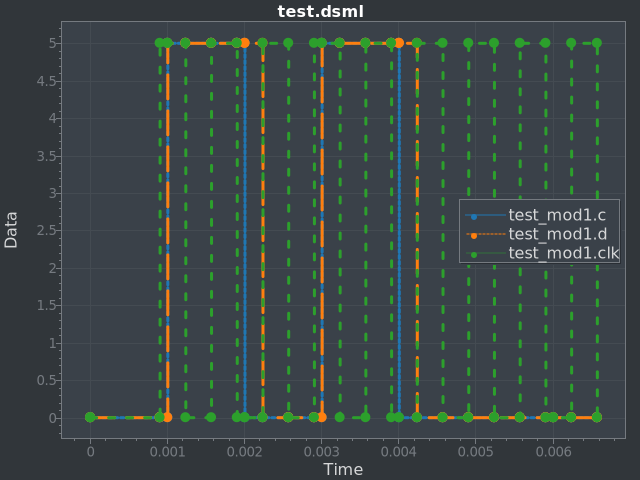

# DSML

## Description

Digital System Markup Language

An XML-based hardware description language, well kind of.

Not NEARLY as feature-filled as something like Verilog, just my attempt.

Example module:

```
<module name="test" inputs="a,b,clk,rst" outputs="c,d,e">
    <wire name="c">
        <!-- c = (a & b) | b -->
        <!-- Loaded from file now <and a="a" b="b"></and> -->
        <file src="and_func.mls"></file>

        <!-- Next is a test and shouldn't do anything actually -->
        <code> "Inputs[\"c\"]" </code>
        <not a="c"></not>
        <not a="c"></not>

        <or a="c" b="b"></or>
    </wire>
    <reg name="d" clock="clk" reset="rst" positive-level="true" active-low="false" default="gnd">
        <!-- d = c (will only activate on clock pulse) -->
        c
    </reg>
</module>

<module name="test2" inputs="f,g,clk2,rst2" outputs="c,d,e">
    <device module="test" inputs="a=f,b=g,clk=clk2,rst=rst2" outputs="c=c,d=d,e=e"></device>
</module>
```

'and_func.mls'
```
Inputs["a"] && Inputs["b"]
```

## Running

`dotnet run <simulation | plot | diagram> <filename>`

*simulation* prints a console output of all your simulations defined in your file

*plot* is the same as simulation, but it creates a window that plots a graph of the results instead of writing to console

*diagram* is unimplemented, but will create a schematic of your device.

Example: `dotnet run plot test.dsml` results in:



## Tag Descriptions

These are just basic explanations. Look at test.dsml to see the application of them.

 * `<module>` - This tag defines a set device that can be tested on. It has inputs and outputs and a name. The inputs and outputs should be delimited by a comma with no spaces

 * `<!-- comments -->` - Anything between `<!--` and `-->` is ignored by the DigitalSystem class in the code when constructing its representation of the DSML

 * `<wire>` - This tag represents a connection inside a device. It has a name which can either be new or a reference to an output. The inner sub-tags of a wire represent (in order) how to calculate value for a tag. These sub-tags will be explained later (note that a single input name can also function as a sub tag)

 * `<reg>` - This tag represents a storage device. It acts much the same as a wire, however it only sets its value when the proper setup is in place. It also has a default value. The setup works as following: if the device is active low, then if reset is gnd, it goes to default value, but if it's *not* active low, then it resets when reset is vcc. When not resetting, if the clock value is vcc and it's positive-level, the register will work just like a wire, and if the clock value is gnd and it's *not* positive-level, then again, it will act as a wire.

 * `<and>` - Takes an a and a b wire input and outputs a && b. This is one of the sub-tags of wire.

 * `<or>` - Takes an a and a b wire input and outputs a || b. This is one of the sub-tags of wire.

 * `<xor>` - Takes an a and a b wire input and outputs a ^ b. This is one of the sub-tags of wire.

 * `<nor>` - Takes an a and a b wire input and outputs !(a || b). This is one of the sub-tags of wire.

 * `<nand>` - Takes an a and a b wire input and outputs !(a && b). This is one of the sub-tags of wire.

 * `<not>` - Takes an a and a b wire input and outputs !a. This is one of the sub-tags of wire.

 * `<file file-name="">` - Loads a custom C# function from a file called `WireFunction` taking a `Dictionary<string, bool>` and outputting a `bool` to represent a wire's value. This is a sub-tag of wire

 * `<code>` - Same as `<file>`, but instead of loading from a file, the code is loaded from a string inside the tag, i.e. `<code>` "blah blah blah" `</code>`

 * `<simulation>` - This defines a simulation to be run. It's sub tags set up what will happen. It takes a name as an attribute

 * `<device>` - Defines a instance of a module that can be test for a simulation. You give it its own id as well as the base module, and you also give it intial values for its inputs along the lines of "input = vcc|gnd"

 * `<clock>` - This creates a clock that oscillates a given device's given input (id) at a given frequency starting at a given time

 * `<assign>` - This sets a given device's given input (id) to a given value at a given time.

 * `<output>` - This displays the value of a given device's connection over time (can be output or input). In 'simulation' mode, it outputs to console. In 'plot' mode, it becomes one line of the plot

## TODO

These are the planned next steps to add to the language add another input to your module's list then set the inputs to the sub-device from the added one

1) Busses/"Arrays" (quality of life)

    - Technically not needed as you could add individual wires for everything, but still useful nonetheless

    - Will be called for simulations like `module.input_bus[index]` just as one familiar with programming would expect

2) Diagram

    - Generates a schematic for each module

3) Rising Edge (and falling edge) Clocs

    - Tons of devices use these, so that would be good to have

    - It seems like a semi-dificult thing to do, and yet not a necessity (for playing around of course. Not talking about "real world" applications)

If you have any suggestions, feel free to email me at dylantdmt@gmail.com!
